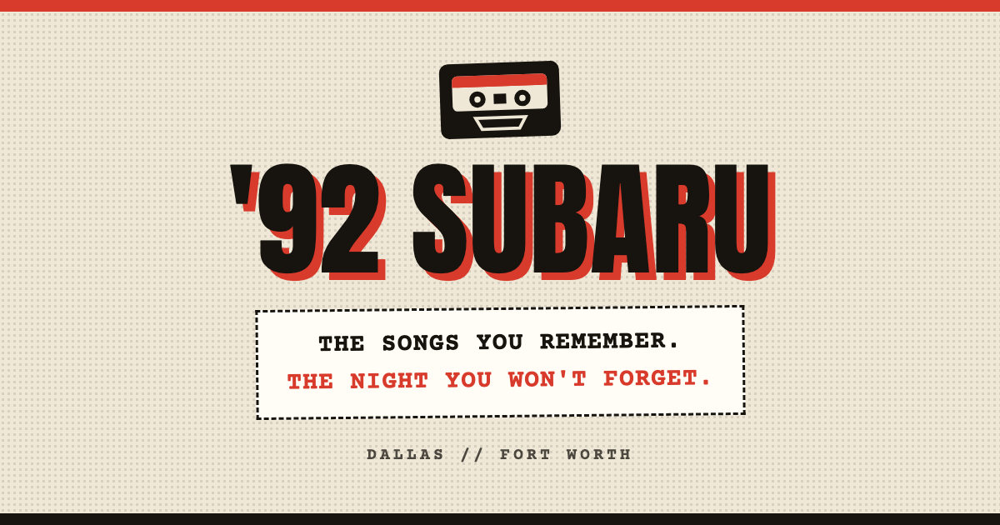

<div align="center">

# 📼 '92 SUBARU
### *The songs you remember. The night you won't forget.*

[](https://92subaruband.com)
[](https://deno.com)
[](https://developer.mozilla.org/en-US/docs/Web/JavaScript)
[](https://developer.mozilla.org/en-US/docs/Web/HTML)
[](https://developer.mozilla.org/en-US/docs/Web/CSS)
[](LICENSE)

<br/>

> **'92 Subaru** brings the soundtrack of the '90s and early 2000s back to life — energetic covers of alternative rock, pop, and grunge hits everyone still knows by heart.
> Built with zero heavyweight client frameworks — pure **HTML5**, **CSS3**, and **Vanilla JavaScript** backed by **Deno** on **Vercel**.

<br/>

</div>

---

## 🎨 Home Page & UI Showcase

Below is a preview of the **'92 Subaru** Home Page interface, capturing the retro 90s cassette mixtape aesthetic, dynamic deck transport controls, and soundtrack J-card tracklist:

<div align="center">



</div>

<br/>

### 🖥️ Interactive UI Component Overview

```
┌─────────────────────────────────────────────────────────────────────────────┐
│  '92 SUBARU                        [ HOME ]   [ ABOUT ]   [ BOOK ▸ ]        │
├─────────────────────────────────────────────────────────────────────────────┤
│                                                                             │
│                            '92 SUBARU                                       │
│              ┌──────────────────────────────────────────┐                   │
│              │    THE SONGS YOU REMEMBER.               │                   │
│              │    THE NIGHT YOU WON'T FORGET.           │                   │
│              └──────────────────────────────────────────┘                   │
│                              |||||||||||||                                  │
│                                                                             │
│         ┌─────────────────────────────────────────────────────────┐         │
│         │ 📼 CASSETTE TAPE DECK (Normal Bias 120µs EQ / SIDE A)   │         │
│         │   [ ◯  LEFT REEL ]   [ WINDOW ]   [ RIGHT REEL ◯ ]      │         │
│         └─────────────────────────────────────────────────────────┘         │
│                                                                             │
│ ┌─────────────────────────────────────────────────────────────────────────┐ │
│ │ ▶ NOW PLAYING: IRIS — Goo Goo Dolls (1998)                              │ │
│ │ 0:00 [████████████████████████████░░░░░░░░░░░░░░░░░░░░░░░] 4:49          │ │
│ │ [ ◄◄ PREV ]     [ ▶ PLAY / ❚❚ PAUSE ]     [ ◼ STOP ]     [ NEXT ►► ]    │ │
│ └─────────────────────────────────────────────────────────────────────────┘ │
│                                                                             │
│ ─── THE SOUNDTRACK (OFFICIAL YOUT RECORDINGS) ────────────────────────────── │
│  01. Iris — Goo Goo Dolls (1998) [▶ YOUTUBE] ....................... 4:49   │
│  02. Kiss Me — Sixpence None the Richer (1997) [▶ YOUTUBE] ......... 3:28   │
│  03. Dreams — The Cranberries (1992) [▶ YOUTUBE] ................... 4:29   │
└─────────────────────────────────────────────────────────────────────────────┘
```

#### 🛠️ Featured UI Elements
- **Retro Cassette Deck Engine:** Vector SVG cassette tape shell with spinning reel animations driven by CSS keyframes (`--reel-play: running`).
- **Deck Transport Controls:** Real-time playback timer, animated progress bar, track pick selection, and Web Audio API tape-hiss synthesis.
- **Soundtrack J-Card Listing:** Single continuous tracklist featuring animated miniature graphic equalizers for active tracks.
- **Single-Page Navigation:** Instant view switching between **Home**, **About**, and **Book** without full page reloads.

---

## 🎸 Overview & Marketing Vision

**'92 Subaru** is a bespoke web experience crafted for the Dallas–Fort Worth metroplex 90s/early-2000s cover band. Designed to deliver an immediate, nostalgic emotional connection, the site pairs a **retro cassette-deck landing page** with a full-featured **Soundtrack transport player** and a direct **booking transmission engine**.

### 🌟 Key Brand Highlights
* **Nostalgic Xerox-Rave Aesthetic:** Tactile cassette tape SVG with animated reels, paper-grain background, retro typography (*Anton*, *Archivo*, *Courier Prime*, *Space Mono*), and warm analog color palette (`#efe8d6`, `#d83a2b`, `#17140f`).
* **Zero Client Overhead:** 100% dependency-free frontend using native browser APIs — sub-second load times, instant response, and zero framework bloat.
* **Direct Booking System of Record:** Booking requests are sanitized, verified against spam, and emailed directly to the band's inbox (`92subaruband@gmail.com`) via Resend — eliminating database maintenance entirely.
* **Interactive Sound Synthesis:** Features an in-browser Web Audio API synth engine simulating worn analog tape hiss, lowpass filtering, and beat synthesis.

---

## ⚡ Technical Stack & Architecture

```
                      ┌───────────────────────────────────────┐
                      │        Vercel Serverless CDN          │
                      │       https://92-subaru.vercel.app    │
                      └──────────────────┬────────────────────┘
                                         │
                 ┌───────────────────────┴───────────────────────┐
                 │                                               │
        [ Static Web Shell ]                            [ Serverless JSON API ]
     public/index.html · app.js                             api/[...slug].ts
     styles.css · 404.html                                          │
                 │                                                ▼
     ┌───────────┴───────────┐                              server/api.ts
     │ Native Browser Engine │                              ├── GET  /api/content
     │  - HTML5 Semantics    │                              └── POST /api/bookings
     │  - CSS Custom Props   │                                      │
     │  - Vanilla JS ES6+    │                                      ▼
     │  - Web Audio API      │                              server/spam.ts + email.ts
     └───────────────────────┘                                      │
                                                                    ▼
                                                            Resend Email Engine
                                                           (92subaruband@gmail.com)
```

### 🎨 Frontend: HTML5 · CSS3 · Vanilla JS
* **HTML5:** Semantic, accessible page layout featuring inline SVG cassette artwork, microdata ready, and zero external web component overhead.
* **CSS3:** Custom animation keyframes (`xscan`, `xflick`, `eqbar`, `cass-reel-spin`), flexbox/grid layout math, custom properties (`--cass-body`, `--reel-speed`), and responsive design optimized for 360px–414px mobile screens up to 4K displays.
* **Vanilla JS (ES6+):** Pure JavaScript handling state management, client-side routing (`Home`, `About`, `Book`), soundtrack transport controls, Web Audio API synthesis, date bounds validation, and asynchronous form submission.

### ⚙️ Backend: Deno 2.x & Serverless Vercel
* **Deno 2.x:** Modern TypeScript runtime used for local development (`server/main.ts`) and unit testing (`deno test`).
* **Vercel Serverless:** Unified deployment utilizing the `vercel-deno` runtime for API endpoints alongside Vercel CDN static hosting.
* **Zero-Database Architecture:** Email is the system of record. Bookings are delivered directly to the band via [Resend](https://resend.com), eliminating database infrastructure overhead.
* **Multi-Layer Spam Protection:** Integrated Google reCAPTCHA v2 verification, honeypot traps, and per-IP sliding window rate limiting.

---

## 🎵 Setlist & Artist Repertoire

The site showcases the band's energetic 90s/2000s setlist pulling from iconic artists:

| Genre | Featured Artists |
|---|---|
| **Alt-Rock** | Oasis, Third Eye Blind, Goo Goo Dolls, Gin Blossoms, Matchbox Twenty, Sugar Ray, Barenaked Ladies |
| **Grunge & Rock** | The Cranberries, Stone Temple Pilots, Green Day, Radiohead, Aerosmith, The Cure |
| **90s Pop & Hits** | No Doubt, Hootie & the Blowfish, 4 Non Blondes, Alanis Morissette, Sheryl Crow, Smash Mouth |

---

## 🚀 Quick Start (Local Development)

Requires [Deno](https://deno.com) 2.x (tested on 2.8+).

### 1. Clone & Run Local Server
```bash
git clone https://github.com/Cazador0/92-Subaru.git
cd 92-Subaru

# Start local server at http://localhost:8000
deno task start
```

### 2. Auto-Reload Dev Mode
```bash
deno task dev
```

### 3. Run Test Suite
```bash
deno task test
```

> **Note for Local Booking Testing:** Set `BOOKING_DEV_LOG=1` in your environment to print outbound booking emails to the terminal console instead of sending real emails.

---

## 📡 HTTP API Reference

| Method | Endpoint | Description | Response |
|---|---|---|---|
| `GET` | `/api/content` | Retrieves ordered soundtrack tracks and tour data | `200 OK` `{ tracks: [...], tour: {...} }` |
| `POST` | `/api/bookings` | Submits a new booking request (emails the band) | `201 Created` `{ ok: true }` |
| `GET` | `/health` | Liveness check & server uptime (local server only) | `200 OK` `{ ok: true, uptime: 123.4 }` |

---

## 🌐 Production Deployment (Vercel)

The application is deployed on Vercel at **`92-subaru.vercel.app`**.

### Environment Variables
Configure the following in your Vercel Project Settings:

| Environment Variable | Description | Default / Example |
|---|---|---|
| `BOOKING_EMAIL` | Destination email inbox for booking submissions | `92subaruband@gmail.com` |
| `RESEND_API_KEY` | Resend API authorization key | `re_...` |
| `RECAPTCHA_SECRET_KEY` | Google reCAPTCHA v2 secret key | `6LeIxAcTAAAAAGG-...` *(Google test key)* |
| `BOOKING_EMAIL_FROM` | Optional verified sender address | `onboarding@resend.dev` |
| `BOOKING_DEV_LOG` | Set to `1` to log emails locally without sending | `0` *(Production)* |

---

## 📁 Repository Structure

```
.
├── deno.json             # Deno configuration, tasks (start / dev / test) & linter
├── vercel.json           # Vercel deployment & vercel-deno runtime config
├── api/
│   └── [...slug].ts      # Vercel serverless entry point delegating to server/api.ts
├── server/
│   ├── main.ts           # Local Deno.serve web server
│   ├── api.ts            # Shared JSON API handler
│   ├── email.ts          # Booking email formatter & Resend integration
│   ├── data.ts           # Content model (soundtrack tracks & gig data)
│   └── spam.ts           # Spam protection (reCAPTCHA v2, honeypot, rate limiter)
├── public/
│   ├── index.html        # App shell & inline interactive Cassette SVG
│   ├── styles.css        # Responsive layout, keyframe animations & retro styles
│   ├── app.js            # Routing, tape transport, Web Audio synth & form handler
│   ├── 404.html          # Themed 'SIDE B NOT FOUND' error page
│   └── privacy.html      # Privacy policy & data collection notice
├── specs/                # Formal product specifications & design artifacts
└── README.md             # Project documentation & marketing showcase
```

---

## 📜 Provenance & License

Designed and engineered for **'92 Subaru**. Recreated from original design handoffs per `web/README.md`.

Distributed under the **MIT License**. See [`LICENSE`](LICENSE) for details.

<div align="center">
  <sub>Built with ❤️, HTML5, CSS3, Vanilla JS, and Deno for '92 Subaru.</sub>
</div>
